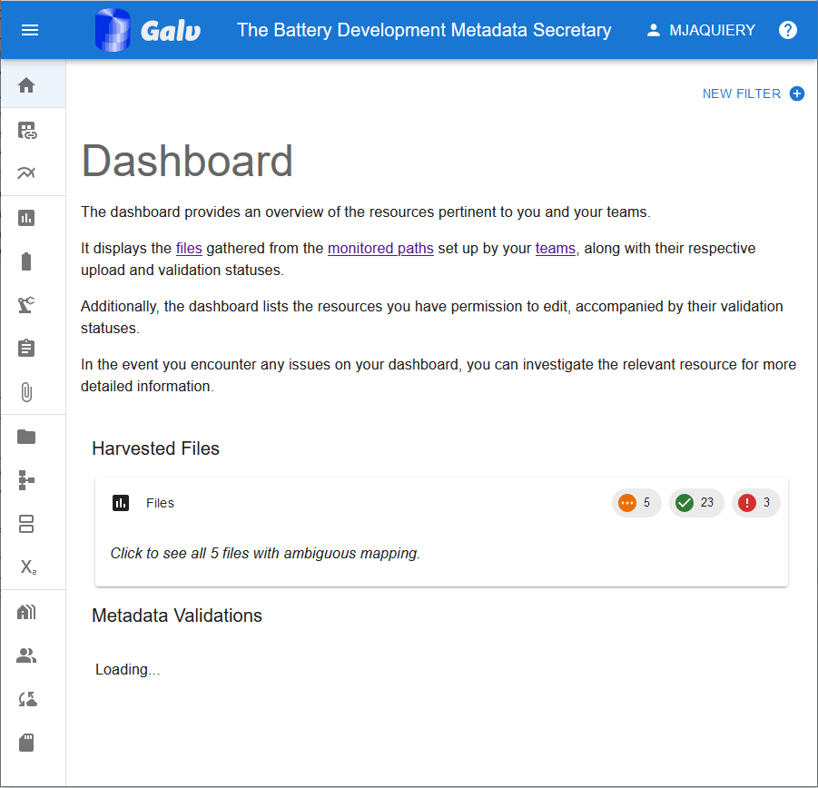

# Galv

Galv is an open-source platform for automated storage of battery data with advanced metadata support for battery scientists.
It is comprised of a REST API backend, a React web app frontend, and a Python program used to harvest data.

We welcome contributions from the community.

## Features:
- REST API for easy data storage and retrieval
- A Python, Julia, and MATLAB client for the REST API
- Metadata support using ontology definitions from BattINFO/EMMO
- A distributed platform with local data harvesters
- Docker based deployment

## Getting Started
Deploying a [Galv](https://github.com/galv-team/galv-backend/) instance in a battery lab can make it easy to access, analyse, and share experimental data. 

Take a look at the [First Time Quick Setup guide](https://galv-team.github.io/galv-backend/FirstTimeQuickSetup.html) to get started.

## Using the platform

You can get to grips with using the [platform](https://github.com/galv-team/galv-frontend/) by reading the [Quick Start guide](https://galv-team.github.io/galv-frontend/GettingStarted.html).

## Using the Harvester

Galv comes with a [program](https://github.com/galv-team/galv-harvester/) for automatically monitoring and uploading cycler data.

You can get started by reading the [README](https://github.com/galv-team/galv-harvester#galv-harvester-python-program) in the Harvester repository.

The harvesters are able to parse the following file types:

- MACCOR files in ``.txt``, ``.xsl``/``.xslx``, or ``raw`` format
- Ivium files in ``.idf`` format
- Biologic files in ``.mpr`` format (EC-Lab firmware < 11.50)
- CSV files

## Platform structure

Data are ingested by Harvester and are associated with metadata using the web application. 
Data and metadata can be downloaded for analysis on demand using the API.

    

